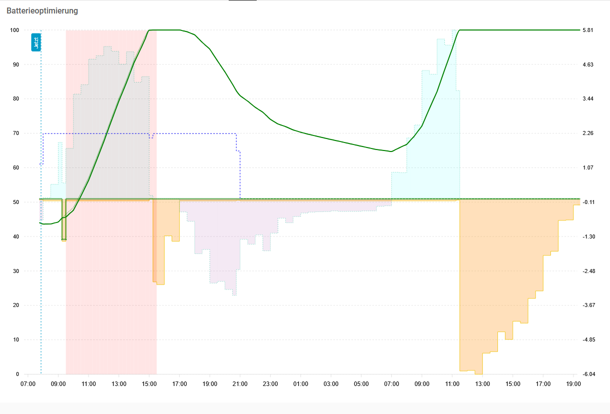

# Energy Advisor

[](https://github.com/Frank-H-H/energy-advisor/actions/workflows/ci.yml)
[](https://codecov.io/gh/Frank-H-H/energy-advisor)
[](https://www.npmjs.com/package/energy-advisor)
[](LICENSE)

Decision-support library for residential energy systems: forecast and advisor engines with Node-RED adapters.

This repository contains:
- Core forecast and advisor engines (ESM) under `src/`
- Node-RED adapter nodes under `nodes/`
- Documentation and examples under `docs/`

## Vision
Example forecast image (visual mock). Shows forecasted battery SOC, expected grid import + export, times of negative energy prices, extra loads like car charging


<details>

<summary>Example config for apex card</summary>

```yaml
type: custom:apexcharts-card
header:
  show: true
  title: Batterieoptimierung
  show_states: true
  colorize_states: true
graph_span: 36h
span:
  start: hour
now:
  show: true
  label: Jetzt
yaxis:
  - decimals: 0
    id: SOC
    min: ~0
    max: ~100
  - decimals: 2
    id: price
    opposite: true
    show: false
    min: ~0
    max: ~0
  - decimals: 2
    id: kW
    opposite: true
    show: true
    min: ~-1
    max: ~1
experimental:
  color_threshold: true
series:
  - entity: sensor.solarsteuerung_testsimulationmitgegenmassnahmen
    float_precision: 2
    name: Preis
    yaxis_id: price
    type: column
    time_delta: +7.5m
    curve: stepline
    opacity: 0.1
    data_generator: |
      return entity.attributes.simulationdata.map((entry) => {
        return [new Date(entry.interval.start), (entry.electricityPrice < 0) ? 999 : 1000];
      });
    show:
      in_header: false
      in_legend: false
    color_threshold:
      - value: 0
        color: red
      - value: 999.5
        color: white
  - entity: sensor.solarsteuerung_testsimulationmitgegenmassnahmen
    name: Batterie
    yaxis_id: SOC
    type: line
    curve: monotoneCubic
    unit: '%'
    extend_to: false
    float_precision: 3
    stroke_width: 2
    data_generator: |
      const now = new Date();
      return entity.attributes.simulationdata.map((entry) => {
        const start = entry.interval.start
        if(now > start) {
          const emulatedStartValue = entry.batteryChargeAtStart - (entry.batteryChargeAtEnd - entry.batteryChargeAtStart) * (60 - now.getMinutes()) / 60
          return [start, emulatedStartValue / 43.52 * 100 || 0];
        } else {
          return [start, entry.batteryChargeAtStart / 43.52 * 100 || 0];
        }
      });
    color_threshold:
      - value: 0
        color: green
      - value: 100
        color: green
      - value: 100.1
        color: red
    show:
      in_header: false
      in_legend: false
  - entity: sensor.solarsteuerung_testsolarsimulation
    name: Batterie (KI)
    yaxis_id: SOC
    type: line
    curve: monotoneCubic
    unit: '%'
    extend_to: false
    float_precision: 3
    stroke_width: 1
    stroke_dash: 1
    data_generator: |
      const now = new Date();
      return entity.attributes.simulationdata.map((entry) => {
        const start = entry.interval.start
        if(now > start) {
          const emulatedStartValue = entry.batteryChargeAtStart - (entry.batteryChargeAtEnd - entry.batteryChargeAtStart) * (60 - now.getMinutes()) / 60
          return [start, emulatedStartValue / 43.52 * 100];
        } else {
          return [start, entry.batteryChargeAtStart / 43.52 * 100];
        }
      });
    color_threshold:
      - value: 0
        color: green
      - value: 100
        color: green
      - value: 100.01
        color: red
    show:
      in_header: false
      in_legend: false
  - entity: sensor.solarsteuerung_testsolargegenmassnahmen
    name: Gegenmaßnamen
    yaxis_id: kW
    unit: kW
    type: line
    curve: stepline
    extend_to: false
    float_precision: 3
    stroke_width: 3
    stroke_dash: 1
    data_generator: |
      const now = new Date();
      return entity.attributes.simulationdata.map((entry) => {
        return [entry.interval.start, - entry.prematureExportPower];
      });
    color_threshold:
      - value: 0
        color: green
      - value: 43.52
        color: green
      - value: 43.5201
        color: red
    show:
      in_header: false
      in_legend: false
  - entity: sensor.solarsteuerung_testsimulationmitgegenmassnahmen
    name: Ein-/Verkauf
    yaxis_id: kW
    unit: kW
    type: area
    curve: stepline
    extend_to: false
    float_precision: 3
    stroke_width: 1
    stroke_dash: 0
    opacity: 0.3
    data_generator: |
      return entity.attributes.simulationdata.map((entry) => {
        return [entry.interval.start, (entry.importedEnergy - entry.exportedEnergy) * 4 - entry.prematureExportPower];
      });
    color_threshold:
      - value: -7.4
        color: red
      - value: -7.3
        color: darkorange
      - value: 0
        color: darkorange
      - value: 1
        color: green
    show:
      in_header: false
      in_legend: false
  - entity: sensor.solarsteuerung_testsimulationmitgegenmassnahmen
    name: Autoladung
    yaxis_id: kW
    unit: kW
    type: line
    curve: stepline
    extend_to: false
    float_precision: 3
    stroke_width: 1
    stroke_dash: 3
    data_generator: |
      return entity.attributes.simulationdata.map((entry) => {
        return [entry.interval.start, entry.extraConsumedEnergy * 4];
      });
    color_threshold:
      - value: 0
        color: green
      - value: 0.01
        color: green
      - value: 0.02
        color: blue
    show:
      in_header: false
      in_legend: false
  - entity: sensor.solarsteuerung_testsimulationmitgegenmassnahmen
    name: Batterieladung
    yaxis_id: kW
    unit: kW
    type: area
    opacity: 0.1
    curve: stepline
    extend_to: false
    float_precision: 3
    stroke_width: 0.5
    stroke_dash: 2
    data_generator: |
      return entity.attributes.simulationdata.map((entry) => {
        return [entry.interval.start, (entry.batteryChargeAtEnd - entry.batteryChargeAtStart) * 4];
      });
    color_threshold:
      - value: -0.01
        color: purple
      - value: 0
        color: cyan
    show:
      in_header: false
      in_legend: false
apex_config:
  plotOptions:
    bar:
      columnWidth: 100%

```
</details>


---

## Features

- Forecast engine to compute interval-based forecasts (based on consumption, PV, prices).
- Advisor engine to propose actions (battery charge/discharge, grid import/export) to reduce cost or maximize revenue.
- Node-RED nodes for easy integration into flows:
  - `energy-forecast` - run forecast engine
  - `energy-advisor` - run advisor to produce recommendations
  - Config nodes: `energy-system-config`, `energy-battery-config`, `energy-grid-config`

---

## Quickstart

Since in early development, energy-advisor has not yet been published in npm.

Prerequisites:
- Node.js 18+
- npm

Developer flow (recommended)
1. Clone the repo:
   git clone https://github.com/Frank-H-H/energy-advisor.git
   cd energy-advisor

2. Install dependencies:
   npm install

3. To run Node-RED using the local package (development mode):
   # From project root
   npm link
   # start Node-RED (my local windows machine)
   pm2 start ~/AppData/Roaming/npm/node_modules/node-red/red.js --name "node-red" --watch .

4. Run tests:
   npm test

---


## Contributing

- Fork & branch.
- Follow existing code style; run `npm run lint` before opening PRs.
- For Node-RED UI changes, test in an incognito browser after restarting Node-RED to avoid cached editor HTML.

---

## License

MIT - see LICENSE.
